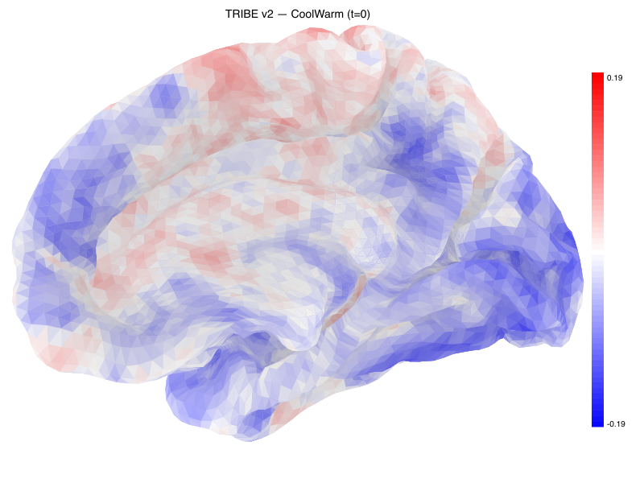
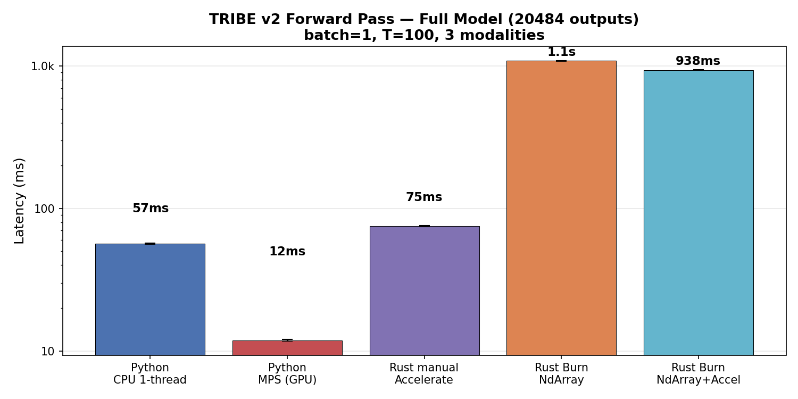
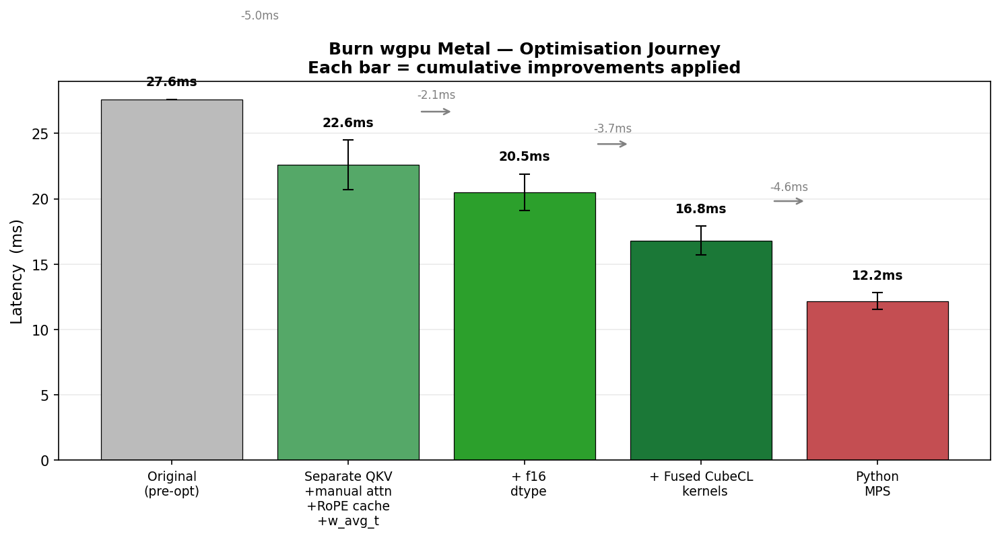
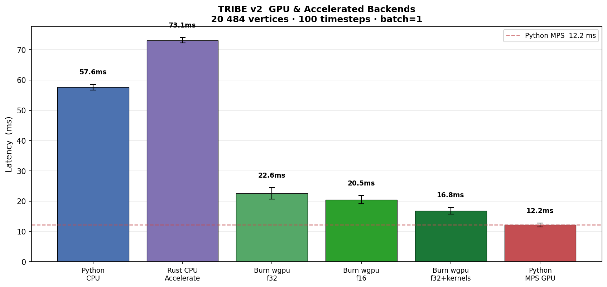
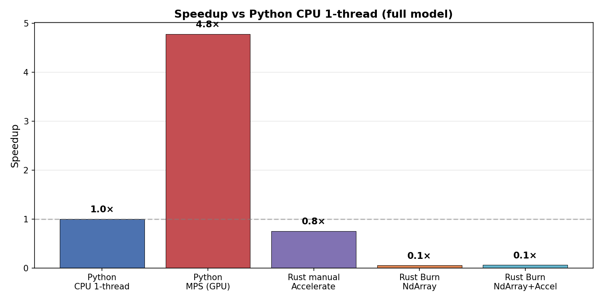

# tribev2-rs

**TRIBE v2 — Multimodal fMRI Brain Encoding Model — Inference in Rust**

Pure-Rust inference for [TRIBE v2](https://github.com/facebookresearch/tribev2) (d'Ascoli et al., 2026), a deep multimodal brain encoding model that predicts fMRI brain responses to naturalistic stimuli (video, audio, text).


*Predicted cortical activity on the fsaverage5 surface (20,484 vertices), rendered from the pretrained TRIBE v2 model with multi-modal input.*

## Features

- **Full model parity** with the Python implementation — every layer type verified
- **Multi-modal inference** — text, audio, and video features simultaneously
- **Text feature extraction** via [llama-cpp-rs](https://github.com/eugenehp/llama-cpp-rs) (LLaMA 3.2-3B with per-token embeddings)
- **Segment-based batching** — long-form inference with configurable overlap and empty-segment filtering
- **Brain surface visualization** — SVG rendering on the real fsaverage5 cortical mesh with 6 views, 6 colormaps, colorbars, RGB multi-modal overlays, mosaics, and time series
- **FreeSurfer mesh loading** — reads `.pial`, `.inflated`, `.white`, `.sulc`, `.curv` binary files
- **Events pipeline** — whisperX/whisper transcription, ffmpeg audio extraction, text-to-events with sentence/context annotation
- **Weight loading** from safetensors (converted from PyTorch Lightning checkpoint)
- **HuggingFace Hub** download support
- **GPU acceleration** — Metal (macOS), CUDA, Vulkan via llama-cpp

## Architecture

The model combines feature extractors — **LLaMA 3.2** (text), **V-JEPA2** (video), and **Wav2Vec-BERT** (audio) — into a unified [x-transformers](https://github.com/lucidrains/x-transformers) Encoder that maps multimodal representations onto the fsaverage5 cortical surface (~20,484 vertices).

| Component | Python | Rust |
|-----------|--------|------|
| Per-modality projectors | `nn.Linear` / `torchvision MLP` | `model::projector::Projector` |
| Feature aggregation | concat / sum / stack | `TribeV2::aggregate_features` |
| Combiner | `nn.Linear` / `nn.Identity` | `model::projector::Projector` (optional) |
| Time positional embedding | `nn.Parameter` | `Tensor` |
| Transformer encoder | `x_transformers.Encoder` | `model::encoder::XTransformerEncoder` |
| ScaleNorm | `x_transformers.ScaleNorm` | `model::scalenorm::ScaleNorm` |
| Rotary position embedding | `x_transformers.RotaryEmbedding` | `model::rotary::RotaryEmbedding` |
| Multi-head attention | `x_transformers.Attention` | `model::attention::Attention` |
| FeedForward (GELU) | `x_transformers.FeedForward` | `model::feedforward::FeedForward` |
| Scaled residual | `x_transformers.Residual` | `model::residual::Residual` |
| Low-rank head | `nn.Linear(bias=False)` | `Tensor` matmul |
| Subject layers | `SubjectLayersModel` | `model::subject_layers::SubjectLayers` |
| Temporal smoothing | depthwise `nn.Conv1d` | `model::temporal_smoothing::TemporalSmoothing` |
| Adaptive avg pool | `nn.AdaptiveAvgPool1d` | `Tensor::adaptive_avg_pool1d` |

### Additional modules (beyond model core)

| Python | Rust | Module |
|--------|------|--------|
| `TribeModel.predict()` | `predict_segmented()` | `segments.rs` |
| `TribeModel.get_events_dataframe()` | `build_events_from_media()` | `events.rs` |
| `ExtractWordsFromAudio` | `transcribe_audio()` | `events.rs` |
| `get_audio_and_text_events()` | `build_events_from_media()` | `events.rs` |
| `TextToEvents` | `text_to_events()` | `events.rs` |
| `extract_llama_features()` | `extract_llama_features()` | `features.rs` |
| `PlotBrainNilearn.plot_surf()` | `render_brain_svg()` | `plotting.rs` |
| `PlotBrainNilearn.plot_surf_rgb()` | `render_hemisphere_rgb_svg()` | `plotting.rs` |
| `BasePlotBrain.plot_timesteps()` | `render_timesteps()` | `plotting.rs` |
| `BasePlotBrain.plot_timesteps_mp4()` | `render_timesteps_mp4()` | `plotting.rs` |
| `robust_normalize()` | `robust_normalize()` | `plotting.rs` |
| `saturate_colors()` | `saturate_colors()` | `plotting.rs` |
| `get_rainbow_brain()` | `rainbow_brain()` | `plotting.rs` |
| `combine_mosaics()` | `combine_svgs()` | `plotting.rs` |
| `read_freesurfer_surface()` | `read_freesurfer_surface()` | `fsaverage.rs` |
| `read_freesurfer_curv()` | `read_freesurfer_curv()` | `fsaverage.rs` |
| HCP ROI analysis | via `exg::surface` | [`exg`](https://github.com/eugenehp/exg) |

## Quick Start

### 1. Download and convert weights

```bash
# Download from HuggingFace
cargo run --bin tribev2-download --features hf-download -- --repo facebook/tribev2

# Convert checkpoint to safetensors
python3 -c "
import torch, safetensors.torch, json
ckpt = torch.load('weights/best.ckpt', map_location='cpu', weights_only=True)
sd = {k.removeprefix('model.'): v for k, v in ckpt['state_dict'].items()}
safetensors.torch.save_file(sd, 'weights/model.safetensors')
ba = ckpt.get('model_build_args', {})
ba = {k: {kk: list(vv) if isinstance(vv, tuple) else vv for kk, vv in v.items()} if isinstance(v, dict) else v for k, v in ba.items()}
json.dump(ba, open('weights/build_args.json', 'w'), indent=2)
"
```

### 2. Run inference

```bash
# Text-only with LLaMA
cargo run --release --bin tribev2-infer -- \
  --config weights/config.yaml \
  --weights weights/model.safetensors \
  --build-args weights/build_args.json \
  --llama-model path/to/llama-3.2-3b.gguf \
  --prompt "The quick brown fox jumps over the lazy dog" \
  --output predictions.bin

# Multi-modal with pre-extracted features + brain plots
cargo run --release --bin tribev2-infer -- \
  --config weights/config.yaml \
  --weights weights/model.safetensors \
  --build-args weights/build_args.json \
  --text-features text.bin --audio-features audio.bin --video-features video.bin \
  --n-timesteps 200 --segment --segment-duration 100 \
  --plot-dir plots/ --view left --cmap coolwarm --colorbar \
  --output predictions.bin
```

### 3. Library usage

```rust
use std::collections::BTreeMap;
use tribev2_rs::model::tribe::TribeV2;
use tribev2_rs::tensor::Tensor;
use tribev2_rs::segments::{SegmentConfig, predict_segmented};
use tribev2_rs::plotting::{self, PlotConfig, View, ColorMap};

// Load pretrained model
let model = TribeV2::from_pretrained(
    "config.yaml", "model.safetensors", Some("build_args.json"),
).unwrap();

// Build multi-modal features: [1, dim, timesteps]
let mut features = BTreeMap::new();
features.insert("text".to_string(),  Tensor::zeros(&[1, 6144, 100]));
features.insert("audio".to_string(), Tensor::zeros(&[1, 2048, 100]));
features.insert("video".to_string(), Tensor::zeros(&[1, 2816, 100]));

// Single forward pass
let output = model.forward(&features, None, true);
// output: [1, 20484, 100]

// Segment-based inference for longer inputs
let seg_config = SegmentConfig { duration_trs: 100, ..Default::default() };
let result = predict_segmented(&model, &features, &seg_config);
// result.predictions: Vec<Vec<f32>> — [n_trs, 20484]

// Brain surface visualization
let brain = tribev2_rs::fsaverage::load_fsaverage(
    "fsaverage5", "half", "sulcal", Some("data"),
).unwrap();
let config = PlotConfig {
    cmap: ColorMap::CoolWarm, colorbar: true,
    symmetric_cbar: true, view: View::Left,
    title: Some("Predicted activity".into()),
    ..Default::default()
};
let svg = plotting::render_brain_svg(&result.predictions[0], &brain, &config);
std::fs::write("brain.svg", &svg).unwrap();
```

## Pretrained Model Details

| Parameter | Value |
|-----------|-------|
| Hidden dim | 1152 |
| Encoder depth | 8 |
| Attention heads | 8 |
| FF multiplier | 4× |
| Norm | ScaleNorm |
| Position encoding | Rotary (dim=72) |
| Modalities | text, audio, video |
| Text extractor | LLaMA-3.2-3B (2 layer groups, dim=3072) |
| Audio extractor | Wav2Vec-BERT 2.0 (2 layer groups, dim=1024) |
| Video extractor | V-JEPA2 ViT-G (2 layer groups, dim=1408) |
| Extractor aggregation | Concatenation |
| Layer aggregation | Concatenation |
| Low-rank head | 2048 |
| Output | fsaverage5 (20,484 vertices) |
| Output timesteps | 100 TRs |

## Feature Flags

| Flag | Description |
|------|-------------|
| **Burn CPU** | |
| `ndarray` | Burn NdArray backend with Rayon (default) |
| `blas-accelerate` | + Apple Accelerate BLAS (fast on Apple Silicon) |
| **Burn GPU** | |
| `wgpu` | Burn wgpu backend — auto-detects Metal/Vulkan/DX12 |
| `wgpu-metal` | + native Metal MSL shaders — fastest on macOS (f32) |
| `wgpu-metal-f16` | + Metal f16 dtype — Metal WMMA path, ~10% faster matmuls |
| `wgpu-kernels-metal` | + fused CubeCL kernels (ScaleNorm + RoPE) — best on macOS |
| `wgpu-vulkan` | + native Vulkan SPIR-V shaders — fastest on Linux/Windows |
| **LLaMA GPU** | |
| `llama-metal` | macOS Metal for LLaMA text extraction (default) |
| `llama-cuda` | NVIDIA CUDA for LLaMA |
| `llama-vulkan` | Vulkan for LLaMA |
| **Utilities** | |
| `hf-download` | HuggingFace Hub download binary |

## Benchmarks

Full forward pass: 1152-d, 8-layer transformer, 20,484 outputs, 100 timesteps, 3 modalities.



| Backend | Mean (ms) | Min (ms) | Std (ms) | vs CPU naive |
|---------|----------:|---------:|---------:|-------------:|
| Rust CPU (naive loops) | 14 516 | 14 350 | 278 | 1× |
| Burn NdArray (Rayon) | 316 | 289 | 36 | 46× |
| Burn NdArray + Accelerate | 143 | 135 | 9 | 102× |
| Rust CPU (Accelerate BLAS) | 73 | 72 | 1 | 199× |
| Python CPU (1 thread) | 58 | 56 | 1 | 252× |
| Burn wgpu Metal f32 | 22.6 | 21.0 | 1.9 | 642× |
| Burn wgpu Metal f16 | 20.5 | 19.1 | 1.4 | 708× |
| **Burn wgpu Metal f32 + fused kernels** | **16.8** | **15.8** | **1.1** | **864×** |
| Python MPS GPU | 12.2 | 11.6 | 0.6 | 1 192× |

*Apple M-series · batch=1 · T=100 · 3 modalities · 20 484 cortical vertices.*

### Optimisation journey (wgpu Metal)



| Step | Change | Δ ms |
|------|--------|------:|
| Original | — | 27.6 ms |
| Non-causal attn · RoPE cache · `narrow` split · pre-transposed w\_avg\_t | architecture fixes | −5.0 ms |
| f16 dtype | Metal WMMA path | −2.1 ms |
| **Fused CubeCL kernels** (ScaleNorm `plane_sum` + single-pass RoPE) | custom kernels | −3.7 ms |
| **Total** | | **16.8 ms** |

The remaining **4.6 ms gap** vs Python MPS is MPSGraph graph-compilation:
PyTorch replays a pre-compiled Metal command buffer; burn-wgpu re-records
every call. Closing it requires a native MPSGraph backend.




```bash
# CPU
cargo run --release --example bench_burn
cargo run --release --example bench_burn --features blas-accelerate
cargo run --release --features accelerate --example bench_rust

# GPU — macOS Metal (f32, default)
cargo run --release --example bench_burn \
  --no-default-features --features wgpu-metal,llama-metal

# GPU — macOS Metal (f16, Metal WMMA)
cargo run --release --example bench_burn \
  --no-default-features --features wgpu-metal-f16,llama-metal

# GPU — macOS Metal (fused CubeCL kernels, fastest)
cargo run --release --example bench_burn \
  --no-default-features --features wgpu-kernels-metal,llama-metal

# GPU — Linux/Windows Vulkan
cargo run --release --example bench_burn \
  --no-default-features --features wgpu-vulkan
```

## Tests

```bash
# All tests (96: unit + integration + parity + e2e)
cargo test

# End-to-end with real pretrained model (requires weights in data/)
cargo test --release test_e2e_multimodal -- --nocapture
```

## Citation

```bibtex
@article{dAscoli2026TribeV2,
  title={A foundation model of vision, audition, and language for in-silico neuroscience},
  author={d'Ascoli, St{\'e}phane and Rapin, J{\'e}r{\'e}my and Benchetrit, Yohann and
          Brookes, Teon and Begany, Katelyn and Raugel, Jos{\'e}phine and
          Banville, Hubert and King, Jean-R{\'e}mi},
  year={2026}
}
```

## License

Apache-2.0
