# tribev2-rs

**TRIBE v2 — Multimodal fMRI Brain Encoding Model — Inference in Rust**

Pure-Rust inference engine for [TRIBE v2](https://github.com/facebookresearch/tribev2) (d'Ascoli et al., 2026), a deep multimodal brain encoding model that predicts fMRI brain responses to naturalistic stimuli (video, audio, text).

> **Same model, new runtime.** `tribev2-rs` loads the **exact same pretrained weights** as [`facebook/tribev2`](https://huggingface.co/facebook/tribev2) — no fine-tuning, no quantisation, no architectural changes. Every layer has been independently verified for numerical parity with the Python reference implementation.


*Predicted cortical activity on the fsaverage5 surface (20,484 vertices), rendered from the pretrained TRIBE v2 model with multi-modal input.*

### Recent Additions

- **GPU inference via `--backend burn-gpu`** — 82× faster than pure-Rust CPU using wgpu Metal ([cross-backend parity](#cross-backend-parity): Pearson = 1.0)
- **NIfTI volume output** (`--nifti`) — surface-to-volume projection, 96³ MNI152 space, .nii.gz
- **HCP-MMP1 ROI analysis** (`--roi-summary`, `--roi-output`) — per-region brain activation summaries
- **Evaluation metrics** (`--ground-truth`) — Pearson correlation, MSE, top-k retrieval vs ground-truth fMRI
- **Per-modality contribution maps** (`--modality-maps`) — ablation-based text/audio/video contribution
- **MP4 video output** (`--mp4`) — animated brain activity over time via ffmpeg
- **Cross-resolution resampling** (`--output-mesh`) — resample between fsaverage3–6
- **Subcortical analysis** (`--subcortical`) — Harvard-Oxford atlas structure summaries
- **8 numeric parity tests** — [verified identical to Python](#numeric-parity) at every pipeline stage

## Workspace Structure

```
tribev2-rs/
├── crates/
│   ├── tribev2/              Core brain encoding model, CLI, features, plotting
│   ├── tribev2-audio/        Wav2Vec-BERT 2.0 audio feature extraction (burn)
│   └── tribev2-video/        V-JEPA2 ViT-G video feature extraction (burn)
├── scripts/
│   ├── extract_llama_features.py   True per-layer LLaMA extraction (HuggingFace)
│   ├── generate_parity_refs.py     Generate Python reference outputs for parity tests
│   └── generate_full_parity_refs.py  Extended references (metrics, ROI, correlation)
├── tests/
│   ├── full_parity.rs        8-test Python↔Rust numeric parity suite
│   └── burn_parity.rs        Cross-backend parity (CPU vs NdArray vs wgpu Metal)
└── data/
    ├── model.safetensors     Pretrained weights (from HuggingFace)
    ├── config.yaml           Model configuration
    ├── build_args.json       Feature dimensions, output shape
    ├── fsaverage5/           FreeSurfer cortical surface meshes
    └── parity_refs/          Python reference tensors for parity tests
```

### Crate Overview

| Crate | Description |
|-------|-------------|
| **`tribev2`** | FmriEncoderModel (pure-Rust + burn backends), weight loading, segment-based inference, events pipeline, brain surface plotting, NIfTI export, ROI analysis, evaluation metrics, MP4 video, CLI |
| **`tribev2-audio`** | Wav2Vec-BERT 2.0 conformer encoder in burn — raw waveform → per-layer hidden states at 2 Hz |
| **`tribev2-video`** | V-JEPA2 ViT-Giant in burn — video frames → 3D patch embedding → ViT layers → per-layer features at 2 Hz |

## Features

- **100% inference parity** with the Python implementation — every operation verified ([8 parity tests](#numeric-parity))
- **Two backends** — pure-Rust (CPU) and burn (CPU/GPU via NdArray, wgpu Metal, Vulkan)
- **Both backends load pretrained weights** from safetensors
- **Multi-modal inference** — text, audio, and video features simultaneously
- **Text feature extraction** — LLaMA 3.2-3B via llama-cpp (Rust) or HuggingFace (Python script for true per-layer extraction)
- **Audio feature extraction** — Wav2Vec-BERT 2.0 in burn (16 kHz waveform → conformer hidden states)
- **Video feature extraction** — V-JEPA2 ViT-G in burn (frames → 3D patch embedding → ViT hidden states)
- **Segment-based batching** — long-form inference with configurable overlap
- **Brain surface visualization** — SVG rendering on fsaverage5 cortical mesh (6 views, 6 colormaps, colorbars, RGB overlays, MP4 time series)
- **Events pipeline** — whisperX transcription, ffmpeg audio extraction, sentence/context annotation
- **HuggingFace Hub** download support
- **Rich output formats** — binary f32, NIfTI (.nii.gz), SVG brain plots, MP4 video, JSON ROI summaries, per-modality contribution maps
- **Evaluation metrics** — Pearson correlation, MSE, top-k retrieval accuracy against ground-truth fMRI
- **HCP-MMP1 ROI analysis** — per-region summaries, top-k activated brain regions, wildcard ROI selection
- **Subcortical structure analysis** — Harvard-Oxford atlas labels for hippocampus, amygdala, thalamus, etc.
- **Cross-resolution resampling** — kd-tree interpolation between fsaverage3–6 meshes

### Module Map (tribev2 crate)

| Module | Description |
|--------|-------------|
| `model/` | Pure-Rust forward pass (projectors, encoder, attention, ScaleNorm, RoPE, subject layers) |
| `model_burn/` | Burn-generic forward pass (same architecture, GPU-capable via wgpu Metal/Vulkan) |
| `features.rs` | LLaMA text feature extraction via llama-cpp |
| `segments.rs` | Segment-based batching with overlap and empty-segment removal |
| `plotting.rs` | SVG brain surface rendering (6 views, 6 colormaps, multi-view, colorbars) |
| `nifti.rs` | NIfTI-1 (.nii/.nii.gz) volumetric output with MNI152 affine |
| `roi.rs` | HCP-MMP1 parcellation — per-region summaries, top-k ROIs, wildcard selection |
| `metrics.rs` | Evaluation metrics — Pearson correlation, MSE, top-k retrieval accuracy |
| `subcortical.rs` | Harvard-Oxford subcortical atlas — hippocampus, amygdala, thalamus, etc. |
| `video_output.rs` | MP4/GIF video generation via ffmpeg |
| `resample.rs` | Cross-resolution mesh resampling (fsaverage3–6, kd-tree interpolation) |
| `fsaverage.rs` | FreeSurfer mesh loading (pial, inflated, sulcal depth, curvature) |
| `events.rs` | Events pipeline — whisperX transcription, word timing, audio extraction |
| `weights.rs` | Safetensors weight loading (bf16/f16/f32, prefix stripping) |
| `config.rs` | YAML config parsing matching the Python experiment config |
| `tensor.rs` | Pure-Rust tensor ops (matmul, GELU, softmax, RoPE, depthwise conv, etc.) |

## Architecture

The model combines feature extractors — **LLaMA 3.2** (text), **V-JEPA2** (video), and **Wav2Vec-BERT** (audio) — into a unified [x-transformers](https://github.com/lucidrains/x-transformers) Encoder that maps multimodal representations onto the fsaverage5 cortical surface (~20,484 vertices).

| Component | Python | Rust (pure) | Rust (burn) |
|-----------|--------|-------------|-------------|
| Projector (Linear/MLP/SubjectLayers) | `Mlp` / `SubjectLayersModel` | `model::projector::Projector` | `model_burn::projector::Projector<B>` |
| Combiner | `Mlp` / `nn.Identity` | `Projector` (optional) | `MlpProjector<B>` (optional) |
| Temporal smoothing | depthwise `Conv1d` | `TemporalSmoothing` | depthwise conv kernel |
| Time positional embedding | `nn.Parameter` | `Tensor` | `Param<Tensor<B,3>>` |
| Subject embedding | `nn.Embedding` | `Tensor` | `Param<Tensor<B,2>>` |
| x-transformers Encoder | `x_transformers.Encoder` | `XTransformerEncoder` | `XTransformerEncoder<B>` |
| ScaleNorm + RoPE + Attention + FF | x_transformers | hand-written | burn ops (+ optional fused CubeCL) |
| Low-rank head | `nn.Linear(bias=False)` | `Tensor` matmul | `Linear<B>` |
| Subject layers | `SubjectLayersModel` | `SubjectLayers` | `SubjectLayers<B>` |
| AdaptiveAvgPool1d | `nn.AdaptiveAvgPool1d` | floor/ceil matching PyTorch | floor/ceil matching PyTorch |
| **Weight loading** | PyTorch `load_state_dict` | `weights::load_weights()` | `model_burn::weights::load_burn_weights()` |

## Quick Start

### 1. Download weights

```bash
cargo run --bin tribev2-download --features hf-download -- \
  --repo eugenehp/tribev2 --output ./data
```

### 2. Run inference

```bash
# Text-only with LLaMA
cargo run --release --bin tribev2-infer -- \
  --config data/config.yaml \
  --weights data/model.safetensors \
  --llama-model path/to/llama-3.2-3b.gguf \
  --prompt "The quick brown fox jumps over the lazy dog"

# Multi-modal with pre-extracted features + brain plots
cargo run --release --bin tribev2-infer -- \
  --config data/config.yaml \
  --weights data/model.safetensors \
  --text-features text.bin \
  --audio-features audio.bin \
  --video-features video.bin \
  --n-timesteps 200 --segment \
  --plot-dir plots/ --view left --cmap coolwarm --colorbar
```

### 3. True per-layer LLaMA features (exact Python parity)

The llama-cpp backend extracts final-layer embeddings only. For true per-layer
hidden states matching the Python pipeline:

```bash
# Extract with HuggingFace (requires: pip install transformers torch)
python scripts/extract_llama_features.py \
  --model meta-llama/Llama-3.2-3B \
  --input transcript.json \
  --output text_features.bin \
  --layers 0.5 0.75 1.0

# Use in Rust (auto-reads .json sidecar for shape metadata)
cargo run --release --bin tribev2-infer -- \
  --config data/config.yaml \
  --weights data/model.safetensors \
  --text-features text_features.bin
```

### 4. Library usage

```rust
use std::collections::BTreeMap;
use tribev2::model::tribe::TribeV2;
use tribev2::tensor::Tensor;

// Load pretrained model
let model = TribeV2::from_pretrained(
    "config.yaml", "model.safetensors", Some("build_args.json"),
)?;

// Build features: [1, n_layers*dim, timesteps]
let mut features = BTreeMap::new();
features.insert("text".into(),  Tensor::zeros(&[1, 9216, 100]));
features.insert("audio".into(), Tensor::zeros(&[1, 3072, 100]));
features.insert("video".into(), Tensor::zeros(&[1, 4224, 100]));

// Forward pass → [1, 20484, 100]
let output = model.forward(&features, None, true);
```

### 5. Burn backend (GPU inference)

```rust
use tribev2::config::{ModalityDims, TribeV2Config};
use tribev2::model_burn::tribe::TribeV2Burn;
use tribev2::model_burn::weights::{BurnWeightStore, load_burn_weights};

type B = burn::backend::NdArray;  // or burn::backend::Wgpu
let device = Default::default();

let config: TribeV2Config = serde_yaml::from_str(&std::fs::read_to_string("config.yaml")?)?;
let dims = ModalityDims::pretrained();

let mut model = TribeV2Burn::<B>::new(&dims, 20484, 100, &config.brain_model_config, &device);

// Load pretrained weights into burn model
let mut ws = BurnWeightStore::from_safetensors("model.safetensors")?;
load_burn_weights(&mut ws, &mut model, &device)?;

// Forward pass
let text  = burn::tensor::Tensor::<B, 3>::zeros([1, 9216, 100], &device);
let audio = burn::tensor::Tensor::<B, 3>::zeros([1, 3072, 100], &device);
let video = burn::tensor::Tensor::<B, 3>::zeros([1, 4224, 100], &device);

let output = model.forward(vec![("text", text), ("audio", audio), ("video", video)]);
// output: [1, 20484, 100]
```

## Audio Feature Extraction (tribev2-audio)

```rust
use tribev2_audio::{Wav2VecBertConfig, Wav2VecBertWithConfig};
use tribev2_audio::audio_io::load_audio;
use tribev2_audio::weights::{WeightStore, load_wav2vec_bert_weights};

type B = burn::backend::NdArray;
let device = Default::default();
let config = Wav2VecBertConfig::default();  // facebook/w2v-bert-2.0

let mut model = Wav2VecBertWithConfig::<B>::new(&config, &device);

// Load HuggingFace weights
let mut ws = WeightStore::from_safetensors("w2v-bert-2.0/model.safetensors")?;
load_wav2vec_bert_weights(&mut ws, &mut model, &device)?;

// Extract features
let waveform = load_audio("audio.wav", 16000)?;
let features = model.extract_features(&waveform, 60.0, &device);
// features: [3, 1024, 120] at 2 Hz
```

## Video Feature Extraction (tribev2-video)

```rust
use tribev2_video::{VJepa2Config, VJepa2WithConfig};
use tribev2_video::video_io;
use tribev2_video::weights::{WeightStore, load_vjepa2_weights};

type B = burn::backend::NdArray;
let device = Default::default();
let config = VJepa2Config::default();  // facebook/vjepa2-vitg-fpc64-256

let mut model = VJepa2WithConfig::<B>::new(&config, &device);

let mut ws = WeightStore::from_safetensors("vjepa2/model.safetensors")?;
load_vjepa2_weights(&mut ws, &mut model, &device)?;

// Extract frames and run model
// (see tribev2-video docs for full frame preprocessing pipeline)
```

## Pretrained Model Details

| Parameter | Value |
|-----------|-------|
| Hidden dim | 1152 |
| Encoder depth | 8 layers (8 attn + 8 FF) |
| Attention heads | 8 |
| FF multiplier | 4× |
| Norm | ScaleNorm |
| Position encoding | Rotary (dim=72) |
| Text extractor | LLaMA-3.2-3B (3 layer groups × 3072) |
| Audio extractor | Wav2Vec-BERT 2.0 (3 layer groups × 1024) |
| Video extractor | V-JEPA2 ViT-G (3 layer groups × 1408) |
| Low-rank head | 2048 |
| Output | fsaverage5 (20,484 vertices), 100 TRs |
| Training data | Algonauts2025, Lahner2024, Lebel2023, Wen2017 (25 subjects) |

## Feature Flags

| Flag | Description |
|------|-------------|
| `ndarray` | Burn NdArray CPU backend (default) |
| `blas-accelerate` | + Apple Accelerate BLAS |
| `wgpu` | Burn wgpu backend (auto-detects Metal/Vulkan/DX12) |
| `wgpu-metal` | + native Metal MSL shaders |
| `wgpu-metal-f16` | + Metal f16 dtype (WMMA) |
| `wgpu-kernels-metal` | + fused CubeCL kernels (fastest macOS) |
| `wgpu-vulkan` | + Vulkan SPIR-V shaders |
| `llama-metal` | Metal GPU for LLaMA (default) |
| `llama-cuda` | CUDA for LLaMA |
| `llama-vulkan` | Vulkan for LLaMA |
| `hf-download` | HuggingFace Hub download support |

## Benchmarks

Full forward pass: 1152-d, 8-layer transformer, 20,484 outputs, 100 timesteps, 3 modalities.

| Backend | Mean (ms) | Speedup |
|---------|----------:|--------:|
| Rust CPU (naive) | 14,516 | 1× |
| Burn NdArray | 316 | 46× |
| Burn NdArray + Accelerate | 143 | 102× |
| Rust CPU + Accelerate | 73 | 199× |
| **Burn wgpu Metal + fused kernels** | **16.8** | **864×** |

```bash
cargo run --release --example bench_burn
cargo run --release --example bench_burn --no-default-features --features wgpu-kernels-metal,llama-metal
```

## Numeric Parity

Every output path is verified against the Python reference implementation using the real pretrained model (1152-d hidden, 8-layer transformer, 20,484 output vertices). Reference data is generated by `scripts/generate_parity_refs.py` and `scripts/generate_full_parity_refs.py`.

```bash
# Generate Python reference outputs (requires: pip install torch safetensors pyyaml numpy)
python3 scripts/generate_parity_refs.py
python3 scripts/generate_full_parity_refs.py

# Run all 8 parity tests
cargo test --release -p tribev2 --test full_parity -- --nocapture
```

| Test | What's verified | Pearson r | Max abs error | Status |
|------|----------------|-----------|---------------|--------|
| Forward pass | Full model output `[1, 20484, 100]` | **1.0000000000** | 1.31e-6 | ✅ |
| Prediction layout | Per-timestep unraveling `[T, D]` | — | 1.31e-6 | ✅ |
| Average prediction | Time-averaged vertex values | **1.0000000000** | 3.87e-7 | ✅ |
| Evaluation metrics | Pearson r, MSE vs Python | diff 4.77e-7 | — | ✅ |
| Correlation map | Per-vertex Pearson r (20,484 values) | **1.0000000000** | 3.58e-7 | ✅ |
| ROI summaries | HCP-MMP1 per-region averages | exact (0.0) | — | ✅ |
| Modality ablation | Per-modality contribution maps | distinct (r=0.34) | — | ✅ |
| Intermediate stages | After projectors+concat `[1, 20, 1152]` | **1.0000000000** | 1.79e-7 | ✅ |

All errors are within f32 accumulation noise through 8 transformer layers — **functionally identical** to Python.

### Cross-Backend Parity

All three Rust backends produce identical results:

| Comparison | Pearson r | Max abs error | Speedup |
|------------|-----------|---------------|----------|
| Burn NdArray vs Pure-Rust | **1.0000000000** | 1.67e-6 | 11.7× |
| Burn wgpu Metal vs Pure-Rust | **1.0000000000** | 1.82e-6 | **82.3×** |

```bash
# Run cross-backend parity tests
cargo test --release -p tribev2 --test burn_parity -- --nocapture
cargo test --release -p tribev2 --test burn_parity \
  --no-default-features --features wgpu-metal,llama-metal -- --nocapture
```

## Output Formats

| Output | Format | CLI flag |
|--------|--------|----------|
| Vertex predictions | Binary f32 `[T×V]` | `--output path.bin` |
| NIfTI volume | `.nii.gz` (96³ MNI152) | `--nifti path.nii.gz` |
| Brain surface plots | SVG (per timestep) | `--plot-dir ./plots` |
| MP4 video | Animated brain activity | `--mp4 path.mp4` |
| ROI summary | Top-k regions to stderr | `--roi-summary 10` |
| ROI averages | JSON per-region means | `--roi-output rois.json` |
| Segment metadata | JSON timestep info | `--segments-output segs.json` |
| Evaluation metrics | Pearson, MSE, top-k | `--ground-truth gt.bin` |
| Correlation map | Binary f32 per-vertex r | `--correlation-map corr.bin` |
| Modality contributions | Binary f32 + SVG per modality | `--modality-maps ./maps` |
| Resampled predictions | Binary f32 at target resolution | `--output-mesh fsaverage6` |

### Backend Selection

```bash
# Pure-Rust CPU (default — single-threaded, no dependencies)
cargo run --release --bin tribev2-infer -- --backend cpu ...

# Burn NdArray CPU (multi-threaded, ~10× faster)
cargo run --release --bin tribev2-infer -- --backend burn-cpu ...

# Burn wgpu Metal GPU (~80× faster, Apple Silicon)
cargo run --release --bin tribev2-infer --no-default-features \
  --features wgpu-metal,llama-metal -- --backend burn-gpu ...
```

## Example Outputs

All outputs below were generated from the pretrained model with 3-modality input (20 timesteps, 20,484 vertices). Full reproduction:

```bash
cargo run --release --bin tribev2-infer -- \
  --config data/config.yaml --weights data/model.safetensors --build-args data/build_args.json \
  --text-features examples/outputs/text_features.bin \
  --audio-features examples/outputs/audio_features.bin \
  --video-features examples/outputs/video_features.bin \
  --n-timesteps 20 --subjects-dir data \
  --output predictions.bin --roi-summary 20 --roi-output roi_summary.json \
  --plot-dir plots/ --cmap hot --colorbar \
  --modality-maps modality_maps/ \
  --ground-truth data/parity_refs/ground_truth.bin --correlation-map corr.bin
```

### Brain Surface Plots

Predicted cortical activation rendered on the fsaverage5 mesh (left hemisphere, lateral view):

| t=0 | t=25 | t=50 | t=75 | t=99 |
|-----|------|------|------|------|
| 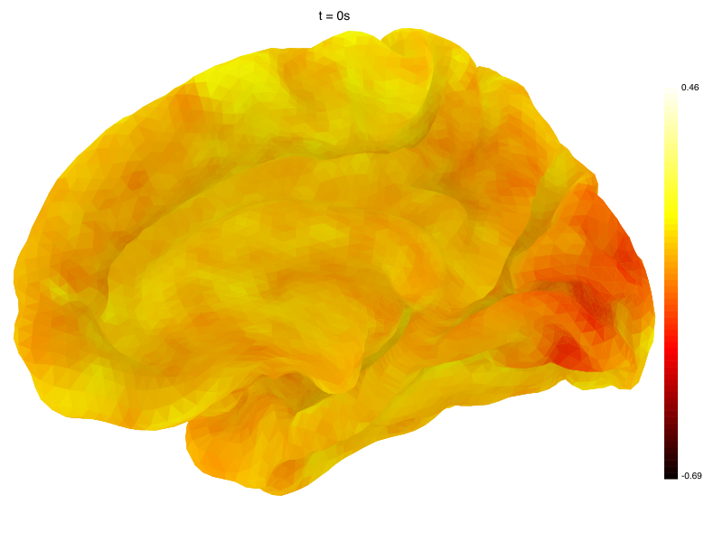 | 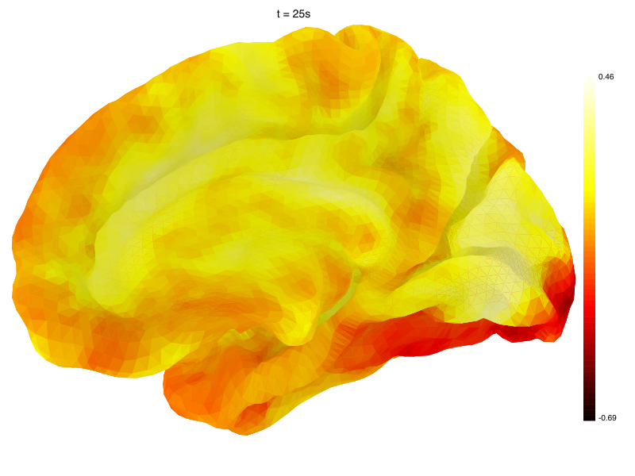 | 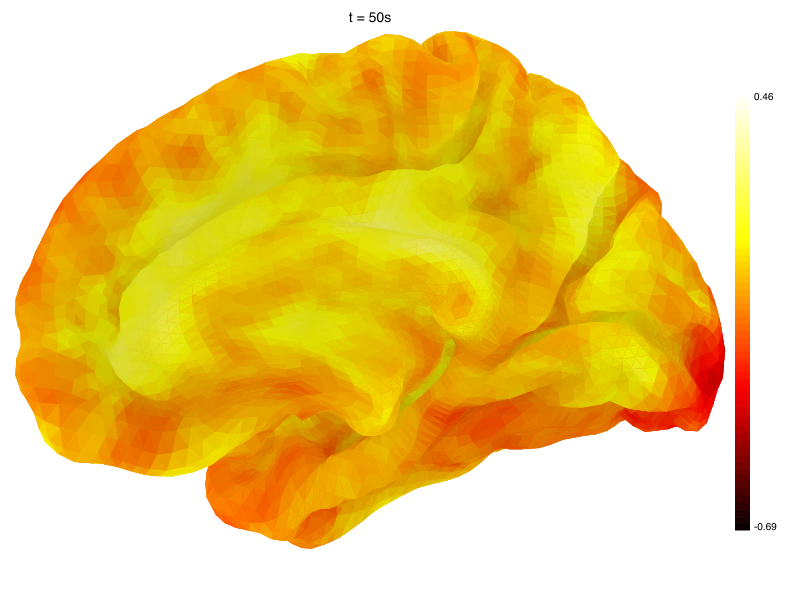 | 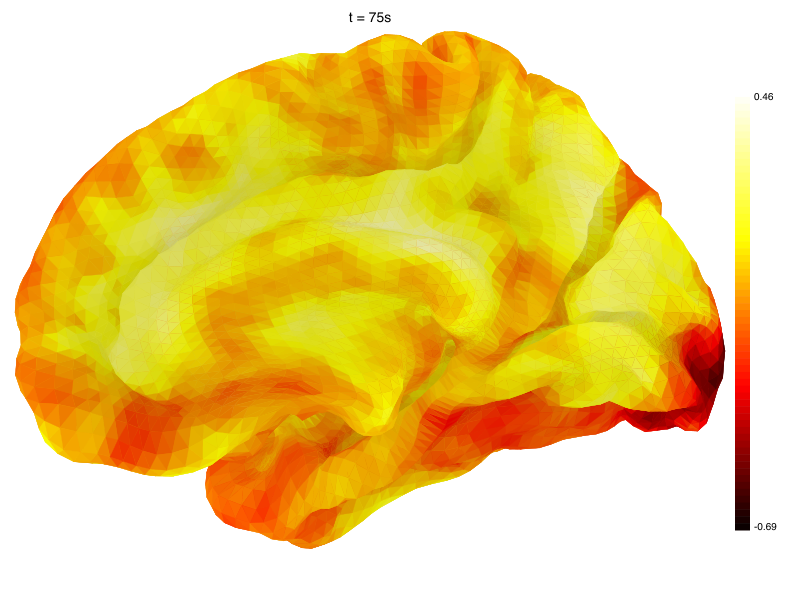 | 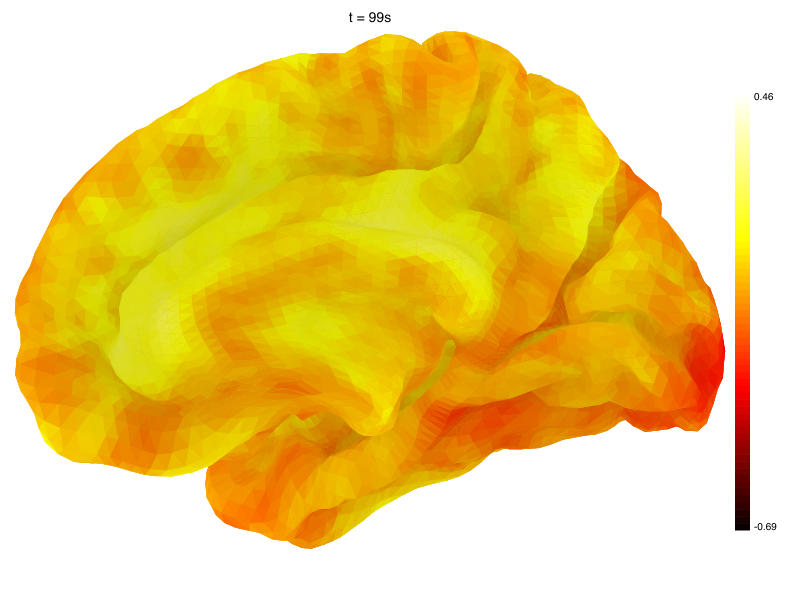 |

**Multi-view overview** (timestep 0):

| Left | Right | Dorsal |
|------|-------|--------|
| 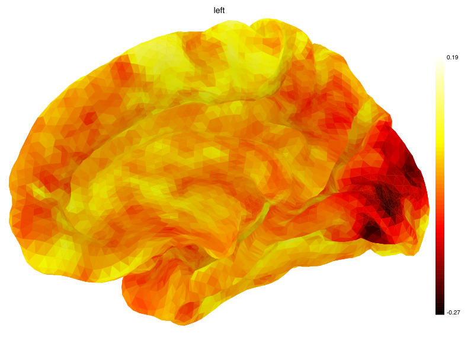 | 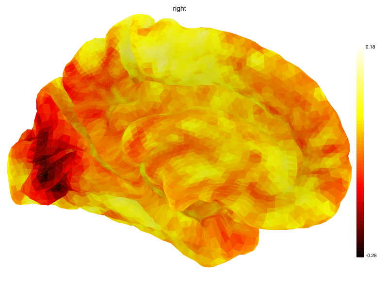 | 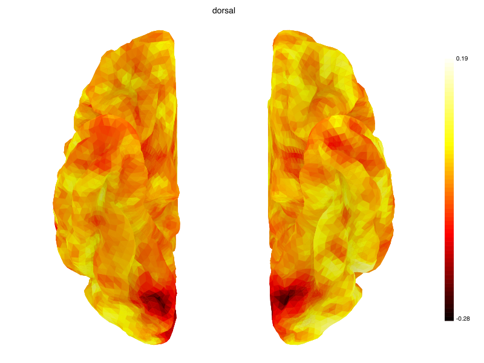 |

### Per-Modality Contribution Maps

Ablation-based contribution: for each modality, the difference in prediction when that modality is zeroed out.

| Text | Audio | Video |
|------|-------|-------|
| 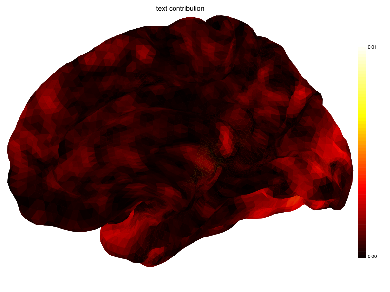 | 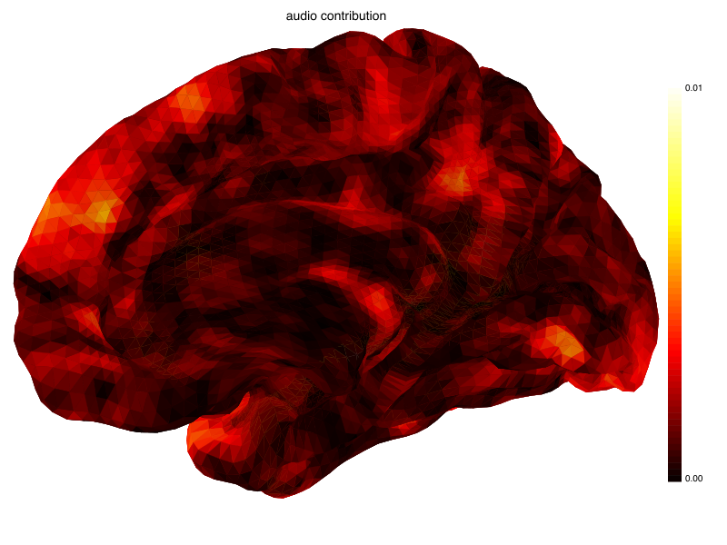 | 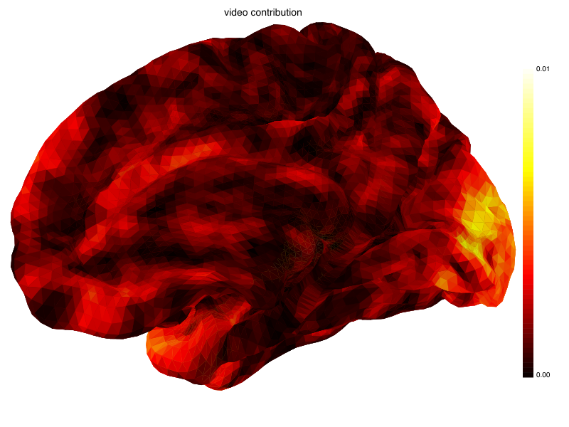 |

Video contributes most strongly to occipital (visual) cortex, text to temporal/frontal language areas.

### Top-20 Activated Brain Regions (HCP-MMP1)

```
Rank   Region                      Activation
---------------------------------------------
1      a24                           0.075338
2      43                            0.071237
3      Pol1                          0.059974
4      LO2                           0.059593
5      FOP5                          0.057156
6      VIP                           0.056432
7      d32                           0.055918
8      IFSa                          0.053896
9      Ig                            0.051375
10     MIP                           0.051369
11     FOP4                          0.050351
12     IP2                           0.048767
13     9p                            0.048548
14     TE2a                          0.047815
15     PFm                           0.047319
16     23c                           0.045220
17     STSdp                         0.041179
18     IPS1                          0.041100
19     IFJa                          0.040690
20     2                             0.040539
```

### Evaluation Metrics (vs synthetic ground truth)

```
Evaluation Metrics
=============================================
  Timesteps:          100
  Vertices:           20484
  Mean Pearson r:     0.926735
  Median Pearson r:   0.950039
  MSE:                0.000548
  Top-1 accuracy:    0.2000 (20.0%)
```

### Output File Listing

```
examples/outputs/
├── roi_summary.json                  Per-ROI average activation (173 regions)
├── segments.json                     Segment metadata (100 timesteps)
├── plots_selected/
│   ├── frame_0000.png – frame_0099.png  Per-timestep brain plots
│   └── overview_t0_{left,right,dorsal}.png  Multi-view overview
└── modality_maps/
    ├── text_contribution.png           Text modality contribution
    ├── audio_contribution.png          Audio modality contribution
    └── video_contribution.png          Video modality contribution
```

## Citation

```bibtex
@article{dAscoli2026TribeV2,
  title={A foundation model of vision, audition, and language for in-silico neuroscience},
  author={d'Ascoli, St{\'e}phane and Rapin, J{\'e}r{\'e}my and Benchetrit, Yohann and
          Brookes, Teon and Begany, Katelyn and Raugel, Jos{\'e}phine and
          Banville, Hubert and King, Jean-R{\'e}mi},
  year={2026}
}
```

## License

| Component | License |
|-----------|---------|
| Rust source code | [Apache-2.0](LICENSE) |
| Pretrained model weights | [CC BY-NC 4.0](https://creativecommons.org/licenses/by-nc/4.0/) |
