# tribev2-rs

**TRIBE v2 — Multimodal fMRI Brain Encoding Model — Inference in Rust**

Pure-Rust inference engine for [TRIBE v2](https://github.com/facebookresearch/tribev2) (d'Ascoli et al., 2026), a deep multimodal brain encoding model that predicts fMRI brain responses to naturalistic stimuli (video, audio, text).

> **Same model, new runtime.** `tribev2-rs` loads the **exact same pretrained weights** as [`facebook/tribev2`](https://huggingface.co/facebook/tribev2) — no fine-tuning, no quantisation, no architectural changes. Every layer has been independently verified for numerical parity with the Python reference implementation.

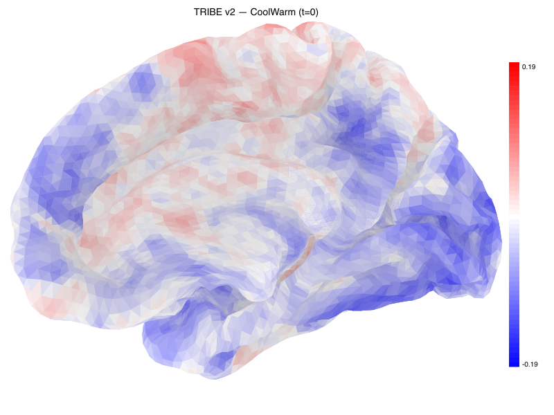
*Predicted cortical activity on the fsaverage5 surface (20,484 vertices), rendered from the pretrained TRIBE v2 model with multi-modal input.*

### Recent Additions

- **End-to-end media pipeline** (`--video-path`, `--audio-path`, `--text-path`) — raw media → brain predictions in one command
- **GPU inference via `--backend burn-gpu`** — 84× faster than pure-Rust CPU using wgpu Metal ([3-backend parity](#cross-backend-parity): Pearson = 1.0)
- **Volume-to-surface projection** (`--fmri-input`) — load raw NIfTI fMRI and project to cortical surface
- **NIfTI volume output** (`--nifti`) — surface-to-volume projection with 6mm Gaussian smoothing
- **HCP-MMP1 ROI analysis** (`--roi-summary`, `--roi-output`) — per-region brain activation summaries
- **Evaluation metrics** (`--ground-truth`) — Pearson correlation, MSE, top-k retrieval vs ground-truth fMRI
- **Per-modality contribution maps** (`--modality-maps`) — ablation-based text/audio/video contribution
- **Stimulus-aligned visualization** (`--stimulus-html`) — HTML with video frames + brain activity + text aligned
- **Text-to-speech** — text input → TTS audio → whisperX → word events → predictions
- **MP4 video output** (`--mp4`) — animated brain activity over time via ffmpeg
- **8 numeric parity tests** — [verified identical to Python](#numeric-parity) across all 3 backends

## Workspace Structure

```
tribev2-rs/
├── crates/
│   ├── tribev2/              Core brain encoding model, CLI, features, plotting
│   ├── tribev2-audio/        Wav2Vec-BERT 2.0 audio features (RLX, optional features)
│   └── tribev2-video/        V-JEPA2 ViT-G video features (RLX, optional features)
├── bench/
│   ├── README.md             Benchmark tables + methodology (Burn vs RLX)
│   ├── summary.json          Machine-readable latest sweep
│   ├── results_*.json        Committed timing data
│   ├── run_all_backends.sh   Local multi-build backend sweep
│   └── run_cuda_rig.sh       CUDA-focused sweep (Linux / rig)
├── rig.sh                    Remote Windows + WSL test/bench (like ../rlx/rig.sh)
├── scripts/
│   ├── extract_llama_features.py   True per-layer LLaMA extraction (HuggingFace)
│   ├── generate_parity_refs.py     Generate Python reference outputs for parity tests
│   ├── generate_full_parity_refs.py  Extended references (metrics, ROI, correlation)
│   ├── check_rlx_gpu_backends.sh   RLX CUDA/wgpu probe (Linux/WSL/Git Bash)
│   └── rig/                  Remote rig config (local.env.example)
├── tests/
│   ├── full_parity.rs        8-test Python↔Rust numeric parity suite
│   └── burn_parity.rs        Cross-backend parity (CPU vs NdArray vs wgpu Metal)
└── data/                     Local only — **weights are not in git** (see data/README.md)
    ├── config.yaml           Model configuration (committed)
    ├── build_args.json       Feature dimensions, output shape (committed)
    ├── model.safetensors     Download via `tribev2-download` (~700 MB, gitignored)
    ├── fsaverage5/           FreeSurfer meshes (gitignored)
    └── parity_refs/          Parity refs (gitignored; regenerate via scripts/)
```

**RLX backends** pull [`rlx`](https://crates.io/crates/rlx) and model crates ([`rlx-llama32`](https://crates.io/crates/rlx-llama32), [`rlx-wav2vec2-bert`](https://crates.io/crates/rlx-wav2vec2-bert), [`rlx-vjepa2`](https://crates.io/crates/rlx-vjepa2)) from crates.io — no sibling checkout required. The `rlx/mlx` feature still needs a git dependency on [MIT-RLX/rlx](https://github.com/MIT-RLX/rlx) because MLX is vendor-bundled and not on the index.

### Crate Overview

| Crate | Description |
|-------|-------------|
| **`tribev2`** | FmriEncoderModel (pure-Rust + burn backends), weight loading, segment-based inference, events pipeline, brain surface plotting, NIfTI export, ROI analysis, evaluation metrics, MP4 video, CLI |
| **`tribev2-audio`** | Wav2Vec-BERT 2.0 via RLX (`rlx-wav2vec2-bert`) — waveform → per-layer hidden states at 2 Hz |
| **`tribev2-video`** | V-JEPA2 ViT-Giant via RLX (`rlx-vjepa2`) — video → per-layer features at 2 Hz |

## Features

- **100% inference parity** with the Python implementation — every operation verified ([8 parity tests](#numeric-parity))
- **Three encoder backends** (all opt-in via Cargo features) — pure-Rust `TribeV2` (always built), optional Burn (NdArray/wgpu), optional RLX (cpu/metal/mlx/cuda/…)
- **Both backends load pretrained weights** from safetensors
- **Multi-modal inference** — text, audio, and video features simultaneously
- **Text feature extraction** — LLaMA 3.2-3B via RLX / `rlx-llama32` (Rust) or HuggingFace (Python script)
- **Audio feature extraction** — Wav2Vec-BERT 2.0 via RLX (16 kHz waveform → conformer hidden states)
- **Video feature extraction** — V-JEPA2 ViT-G via RLX (frames → ViT hidden states)
- **Segment-based batching** — long-form inference with configurable overlap
- **Brain surface visualization** — SVG rendering on fsaverage5 cortical mesh (6 views, 6 colormaps, colorbars, RGB overlays, MP4 time series)
- **Events pipeline** — whisperX transcription, ffmpeg audio extraction, sentence/context annotation
- **HuggingFace Hub** download support
- **Rich output formats** — binary f32, NIfTI (.nii.gz), SVG brain plots, MP4 video, JSON ROI summaries, per-modality contribution maps
- **Evaluation metrics** — Pearson correlation, MSE, top-k retrieval accuracy against ground-truth fMRI
- **HCP-MMP1 ROI analysis** — per-region summaries, top-k activated brain regions, wildcard ROI selection
- **Subcortical structure analysis** — Harvard-Oxford atlas labels for hippocampus, amygdala, thalamus, etc.
- **Cross-resolution resampling** — kd-tree interpolation between fsaverage3–6 meshes
- **End-to-end media pipeline** — video/audio/text → automatic feature extraction → predictions
- **Text-to-speech** — text input → TTS (gtts/macOS say/espeak) → transcription → features
- **Volume-to-surface projection** — load raw NIfTI fMRI and project to cortical surface (ball/line sampling)
- **Stimulus-aligned HTML** — video frames + brain activity + word annotations in scrollable timeline

### Module Map (tribev2 crate)

| Module | Description |
|--------|-------------|
| `model/` | Pure-Rust forward pass (projectors, encoder, attention, ScaleNorm, RoPE, subject layers) |
| `model_burn/` | Burn-generic forward pass (same architecture, GPU-capable via wgpu Metal/Vulkan) |
| `features.rs` | LLaMA text feature extraction via RLX (`rlx-llama32`) |
| `segments.rs` | Segment-based batching with overlap and empty-segment removal |
| `plotting.rs` | SVG brain surface rendering (6 views, 6 colormaps, multi-view, colorbars) |
| `nifti.rs` | NIfTI-1 (.nii/.nii.gz) volumetric output with MNI152 affine |
| `roi.rs` | HCP-MMP1 parcellation — per-region summaries, top-k ROIs, wildcard selection |
| `metrics.rs` | Evaluation metrics — Pearson correlation, MSE, top-k retrieval accuracy |
| `subcortical.rs` | Harvard-Oxford subcortical atlas — hippocampus, amygdala, thalamus, etc. |
| `video_output.rs` | MP4/GIF video generation via ffmpeg |
| `resample.rs` | Cross-resolution mesh resampling (fsaverage3–6, kd-tree interpolation) |
| `fsaverage.rs` | FreeSurfer mesh loading (pial, inflated, sulcal depth, curvature) |
| `events.rs` | Events pipeline — whisperX transcription, word timing, audio extraction |
| `weights.rs` | Safetensors weight loading (bf16/f16/f32, prefix stripping) |
| `config.rs` | YAML config parsing matching the Python experiment config |
| `pipeline.rs` | End-to-end media → prediction pipeline (TTS, ffmpeg, whisperX, feature extraction) |
| `vol_to_surf.rs` | Volume-to-surface projection (NIfTI fMRI → fsaverage, ball/line sampling, trilinear interp) |
| `tensor.rs` | Pure-Rust tensor ops (matmul, GELU, softmax, RoPE, depthwise conv, etc.) |

## Architecture

The model combines feature extractors — **LLaMA 3.2** (text), **V-JEPA2** (video), and **Wav2Vec-BERT** (audio) — into a unified [x-transformers](https://github.com/lucidrains/x-transformers) Encoder that maps multimodal representations onto the fsaverage5 cortical surface (~20,484 vertices).

| Component | Python | Rust (pure) | Rust (burn) |
|-----------|--------|-------------|-------------|
| Projector (Linear/MLP/SubjectLayers) | `Mlp` / `SubjectLayersModel` | `model::projector::Projector` | `model_burn::projector::Projector<B>` |
| Combiner | `Mlp` / `nn.Identity` | `Projector` (optional) | `MlpProjector<B>` (optional) |
| Temporal smoothing | depthwise `Conv1d` | `TemporalSmoothing` | depthwise conv kernel |
| Time positional embedding | `nn.Parameter` | `Tensor` | `Param<Tensor<B,3>>` |
| Subject embedding | `nn.Embedding` | `Tensor` | `Param<Tensor<B,2>>` |
| x-transformers Encoder | `x_transformers.Encoder` | `XTransformerEncoder` | `XTransformerEncoder<B>` |
| ScaleNorm + RoPE + Attention + FF | x_transformers | hand-written | burn ops (+ optional fused CubeCL) |
| Low-rank head | `nn.Linear(bias=False)` | `Tensor` matmul | `Linear<B>` |
| Subject layers | `SubjectLayersModel` | `SubjectLayers` | `SubjectLayers<B>` |
| AdaptiveAvgPool1d | `nn.AdaptiveAvgPool1d` | floor/ceil matching PyTorch | floor/ceil matching PyTorch |
| **Weight loading** | PyTorch `load_state_dict` | `weights::load_weights()` | `model_burn::weights::load_burn_weights()` |

## Quick Start

**Build:** `cargo build -p tribev2` uses **no optional features** by default — only the pure-Rust encoder and CLI. Enable Burn or RLX explicitly, e.g. `--features burn,wgpu-metal` or `--features rlx-encoder,rlx-metal`. Convenience bundle: `--features all-engines-cpu` (rust + Burn NdArray + RLX CPU).

### 1. Download weights

Weights (`*.safetensors`, checkpoints, `parity_refs/`) are **gitignored** — clone the repo, then fetch data locally:

```bash
cargo run --bin tribev2-download --features hf-download -- \
  --repo eugenehp/tribev2 --output ./data
```

See **[data/README.md](data/README.md)** for layout and conversion from `.ckpt`.

### 2. Run inference

```bash
# Text-only with LLaMA
cargo run --release --bin tribev2-infer -- \
  --config data/config.yaml \
  --weights data/model.safetensors \
  --llama-model path/to/llama-3.2-3b.gguf \
  --prompt "The quick brown fox jumps over the lazy dog"

# Multi-modal with pre-extracted features + brain plots
cargo run --release --bin tribev2-infer -- \
  --config data/config.yaml \
  --weights data/model.safetensors \
  --text-features text.bin \
  --audio-features audio.bin \
  --video-features video.bin \
  --n-timesteps 200 --segment \
  --plot-dir plots/ --view left --cmap coolwarm --colorbar
```

### 3. End-to-end media pipeline

```bash
# Video → extract audio → transcribe → extract features → brain predictions
cargo run --release --bin tribev2-infer -- \
  --config data/config.yaml --weights data/model.safetensors \
  --video-path clip.mp4 --llama-model llama-3.2-3b.gguf \
  --cache-dir ./cache --output predictions.bin \
  --stimulus-html brain_activity.html

# Audio-only (speech recording)
cargo run --release --bin tribev2-infer -- \
  --config data/config.yaml --weights data/model.safetensors \
  --audio-path speech.wav --llama-model llama-3.2-3b.gguf \
  --cache-dir ./cache --roi-summary 10

# Text-only (TTS → audio → transcribe → predict)
cargo run --release --bin tribev2-infer -- \
  --config data/config.yaml --weights data/model.safetensors \
  --text-path hamlet.txt --llama-model llama-3.2-3b.gguf \
  --cache-dir ./cache --plot-dir plots/

# Load raw fMRI NIfTI and project to surface
cargo run --release --bin tribev2-infer -- \
  --config data/config.yaml --weights data/model.safetensors \
  --fmri-input bold.nii.gz --subjects-dir data --vol-to-surf-radius 3.0
```

### 4. True per-layer LLaMA features (exact Python parity)

The RLX backend exports per-layer hidden states in one prefill pass. For HuggingFace
hidden states matching the Python pipeline:

```bash
# Extract with HuggingFace (requires: pip install transformers torch)
python scripts/extract_llama_features.py \
  --model meta-llama/Llama-3.2-3B \
  --input transcript.json \
  --output text_features.bin \
  --layers 0.5 0.75 1.0

# Use in Rust (auto-reads .json sidecar for shape metadata)
cargo run --release --bin tribev2-infer -- \
  --config data/config.yaml \
  --weights data/model.safetensors \
  --text-features text_features.bin
```

### 5. Library usage

```rust
use std::collections::BTreeMap;
use tribev2::model::tribe::TribeV2;
use tribev2::tensor::Tensor;

// Load pretrained model
let model = TribeV2::from_pretrained(
    "config.yaml", "model.safetensors", Some("build_args.json"),
)?;

// Build features: [1, n_layers*dim, timesteps]
let mut features = BTreeMap::new();
features.insert("text".into(),  Tensor::zeros(&[1, 9216, 100]));
features.insert("audio".into(), Tensor::zeros(&[1, 3072, 100]));
features.insert("video".into(), Tensor::zeros(&[1, 4224, 100]));

// Forward pass → [1, 20484, 100]
let output = model.forward(&features, None, true);
```

### 6. Burn backend (GPU inference)

```rust
use tribev2::config::{ModalityDims, TribeV2Config};
use tribev2::model_burn::tribe::TribeV2Burn;
use tribev2::model_burn::weights::{BurnWeightStore, load_burn_weights};

type B = burn::backend::NdArray;  // or burn::backend::Wgpu
let device = Default::default();

let config: TribeV2Config = serde_yaml::from_str(&std::fs::read_to_string("config.yaml")?)?;
let dims = ModalityDims::pretrained();

let mut model = TribeV2Burn::<B>::new(&dims, 20484, 100, &config.brain_model_config, &device);

// Load pretrained weights into burn model
let mut ws = BurnWeightStore::from_safetensors("model.safetensors")?;
load_burn_weights(&mut ws, &mut model, &device)?;

// Forward pass
let text  = burn::tensor::Tensor::<B, 3>::zeros([1, 9216, 100], &device);
let audio = burn::tensor::Tensor::<B, 3>::zeros([1, 3072, 100], &device);
let video = burn::tensor::Tensor::<B, 3>::zeros([1, 4224, 100], &device);

let output = model.forward(vec![("text", text), ("audio", audio), ("video", video)]);
// output: [1, 20484, 100]
```

## Audio Feature Extraction (tribev2-audio, RLX)

Build with an RLX device feature (none enabled by default):

```bash
cargo build -p tribev2-audio --features rlx-metal   # Apple Silicon
cargo build -p tribev2-audio --features rlx-cuda    # NVIDIA
```

```rust
use tribev2_audio::{audio_io, extract_audio_features, AudioFeatureConfig};

let cfg = AudioFeatureConfig {
    weights_path: "w2v-bert-2.0/model.safetensors".into(),
    device: "metal".into(),
    ..AudioFeatureConfig::default()
};
let waveform = audio_io::load_audio("audio.wav", 16_000)?;
let feats = extract_audio_features(&cfg, &waveform, 60.0, false)?;
// feats.shape ≈ [3, 1024, 120] at 2 Hz
```

Enable live extraction in the main crate: `cargo build -p tribev2 --features audio-rlx`.

## Video Feature Extraction (tribev2-video, RLX)

```rust
use tribev2_video::{extract_video_features, VideoFeatureConfig};

let cfg = VideoFeatureConfig {
    weights_path: "vjepa2/model.safetensors".into(),
    device: "metal".into(),
    ..VideoFeatureConfig::default()
};
let feats = extract_video_features(&cfg, "clip.mp4", 30.0, false)?;
```

Enable in pipeline: `cargo build -p tribev2 --features video-rlx`.

## Pretrained Model Details

| Parameter | Value |
|-----------|-------|
| Hidden dim | 1152 |
| Encoder depth | 8 layers (8 attn + 8 FF) |
| Attention heads | 8 |
| FF multiplier | 4× |
| Norm | ScaleNorm |
| Position encoding | Rotary (dim=72) |
| Text extractor | LLaMA-3.2-3B (3 layer groups × 3072) |
| Audio extractor | Wav2Vec-BERT 2.0 (3 layer groups × 1024) |
| Video extractor | V-JEPA2 ViT-G (3 layer groups × 1408) |
| Low-rank head | 2048 |
| Output | fsaverage5 (20,484 vertices), 100 TRs |
| Training data | Algonauts2025, Lahner2024, Lebel2023, Wen2017 (25 subjects) |

## Feature Flags

**Defaults: none.** `cargo build -p tribev2` does not enable Burn, RLX, or GPU stacks. The pure-Rust encoder (`TribeV2`) is **always compiled** — no feature flag required for inference with `--backend rust` / `cpu`.

| Goal | Example `--features` |
|------|----------------------|
| Minimal (default) | *(omit)* |
| CPU engine comparison | `pure-rust,all-engines-cpu` |
| Apple Silicon GPU | `burn,wgpu-metal`, `rlx-encoder,rlx-metal` |
| NVIDIA GPU | `burn,wgpu`, `rlx-encoder,rlx-cuda` |
| Full text + audio RLX | `rlx`, `rlx-metal`, `audio-rlx` |

Use `./bench/run_all_backends.sh` to benchmark each backend in a separate cargo build. Full flag list: **[docs/FEATURES.md](docs/FEATURES.md)**.

Publish to crates.io: **[scripts/publish.sh](scripts/publish.sh)** (`doctor` → `dry-run` → `publish`). See **[docs/PUBLISHING.md](docs/PUBLISHING.md)**.

### Encoder engines (opt-in)

| Flag | Description |
|------|-------------|
| `pure-rust` | Marker for bench/CI; core `TribeV2` builds without it |
| `burn` | Burn encoder (`TribeV2Burn`) + NdArray matmul |
| `rlx-encoder` | RLX compiled-graph encoder (`TribeRlx`) |
| `rlx-text` | LLaMA feature extraction via `rlx-llama32` (implies `rlx-encoder`) |
| `rlx` | Shorthand for `rlx-encoder` + `rlx-text` |
| `all-engines-cpu` | `pure-rust` + `burn` + `rlx-encoder` + `rlx-cpu` |

### Burn device features (require `burn`)

| Flag | Description |
|------|-------------|
| `burn-cpu` / `ndarray` | Burn NdArray CPU |
| `blas-accelerate` | + Apple Accelerate BLAS |
| `wgpu` | Burn wgpu (auto Metal/Vulkan/DX12) |
| `wgpu-metal` | Native Metal |
| `wgpu-metal-f16` | Metal f16 (WMMA) |
| `wgpu-kernels-metal` | Fused CubeCL kernels (fastest macOS Burn) |
| `wgpu-vulkan` | Vulkan |
| `apple-silicon` | `rlx-metal` + `rlx-mlx` + `burn` + `wgpu-metal` |
| `nvidia-gpu` | `rlx-cuda` + `burn` + `wgpu` |

### RLX device features (require `rlx-encoder`)

| Flag | Device |
|------|--------|
| `rlx-cpu` | CPU |
| `rlx-metal` / `rlx-mps` | Apple Metal (MPS) |
| `rlx-mlx` | Apple MLX |
| `rlx-cuda` | NVIDIA CUDA |
| `rlx-rocm` | AMD ROCm |
| `rlx-gpu` / `rlx-vulkan` | wgpu (Vulkan/Metal/DX12) |

### Other

| Flag | Description |
|------|-------------|
| `audio-rlx` / `video-rlx` | Live Wav2Vec-BERT / V-JEPA2 extractors |
| `hf-download` | HuggingFace Hub download CLI |

### CLI backends (`tribev2-infer --backend`)

| Value | Engine |
|-------|--------|
| `rust`, `cpu` | Pure-Rust (default) |
| `burn`, `burn-cpu`, `burn-gpu` | Burn (needs `burn` + `wgpu` for GPU) |
| `rlx`, `rlx-cpu`, `rlx-metal`, `rlx-mps`, `rlx-mlx`, `rlx-cuda`, `rlx-rocm`, `rlx-wgpu` | RLX encoder |
| `metal`, `mps`, `mlx`, `cuda`, `rocm`, `wgpu` | RLX shorthand |

## Benchmarks

Full methodology, raw JSON, and reproduction commands: **[bench/README.md](bench/README.md)** · **[bench/summary.json](bench/summary.json)**

Apple M4 Pro · encoder forward · output `[1, 20484, 100]` · features from `data/build_args.json`.

### Burn vs RLX — latest sweep (T=10, May 2026)

| Backend | Engine | Device | Mean (ms) | vs Rust |
|---------|--------|--------|----------:|--------:|
| pure-Rust | rust | cpu | 1333.5 | 1.0× |
| RLX | rlx | cpu | 33.8 | 39.5× |
| Burn | burn | ndarray + Accelerate | 66.7 | 20.0× |
| RLX | rlx | **metal** | 15.1 | 88.3× |
| Burn | burn | wgpu-metal (f32) | 13.6 | 98.1× |
| **Burn** | burn | **wgpu-metal-f16** | **10.6** | **125.8×** |

On Apple Silicon, **Burn wgpu Metal (f16)** is fastest (~11 ms); **RLX Metal** (~15 ms) is the best RLX path (use `rlx-metal`, not `rlx-wgpu`). RLX loads pretrained weights; Burn bench uses random-init (same graph size).

### Pipeline run (T=20, includes I/O)

| Backend | Forward (ms) | Speedup |
|---------|----------:|--------:|
| pure-Rust CPU | 3,028 | 1× |
| Burn NdArray CPU | 355 | 8.5× |
| Burn wgpu Metal (warm GPU) | **36** | **84×** |

### Historical (T=100)

| Backend | Mean (ms) | vs naive Rust |
|---------|----------:|--------------:|
| Rust CPU (naive) | 14,516 | 1× |
| Burn NdArray + Accelerate | 143 | 102× |
| **Burn wgpu Metal + fused CubeCL** | **16.8** | **864×** |

```bash
export TRIBEV2_DATA_DIR="${TRIBEV2_DATA_DIR:-./data}"

# One build, selected engines
cargo run --release -p tribev2 --example bench_encoder \
  --no-default-features --features pure-rust,rlx-encoder,rlx-metal,burn,wgpu-metal \
  -- --engines all --timesteps 50 --warmup 2 --runs 5

# Full sweep (separate cargo build per backend)
./bench/run_all_backends.sh

# CUDA on Linux / NVIDIA rig
./bench/run_cuda_rig.sh
./rig.sh --both bench-cuda && ./rig.sh report-cuda
```

### Remote CUDA rig (Windows + WSL)

For an NVIDIA Windows host with WSL2 (same layout as [`../rlx/rig.sh`](../rlx/rig.sh)):

```bash
cp scripts/rig/local.env.example scripts/rig/local.env   # RIG_HOST, SSH_KEY
./rig.sh probe                    # GPU + repo on Windows and Ubuntu WSL
./rig.sh sync && ./rig.sh sync-data
./rig.sh setup-wsl-rust           # once: rustup inside WSL
./rig.sh --both bench-cuda        # CPU + RLX CUDA on MSVC and WSL
./rig.sh fetch-bench && ./rig.sh report-cuda
```

| Command | What it does |
|---------|----------------|
| `bench-cuda` | Runs `bench/run_cuda_rig.sh` — rust CPU, RLX CPU, RLX CUDA (+ wgpu) per runtime |
| `bench` | Full `./bench/run_all_backends.sh` on each runtime |
| `report-cuda` | Table: **Windows vs WSL** mean forward ms (`rlx/cuda`, `rlx/cpu`, `rust/cpu`) |
| `test-cuda` | RLX CUDA parity test (`rlx_parity`) when `data/parity_refs` present |

Results land in `bench/rig/<tag>_windows/` and `bench/rig/<tag>_wsl/` as JSON (`bench/results_*.json` copies). WSL needs the [CUDA toolkit inside Ubuntu](https://docs.nvidia.com/cuda/wsl-user-guide/index.html) (`libcublas.so`) for RLX CUDA; Windows MSVC uses the driver-bundled CUDA DLLs.

On the rig itself (no SSH): `scripts/check_rlx_gpu_backends.sh` or `scripts/check_rlx_gpu_backends.ps1`.

## Numeric Parity

Every output path is verified against the Python reference implementation using the real pretrained model (1152-d hidden, 8-layer transformer, 20,484 output vertices). Reference data is generated by `scripts/generate_parity_refs.py` and `scripts/generate_full_parity_refs.py`.

```bash
# Generate Python reference outputs (requires: pip install torch safetensors pyyaml numpy)
python3 scripts/generate_parity_refs.py
python3 scripts/generate_full_parity_refs.py

# Run all 8 parity tests
cargo test --release -p tribev2 --test full_parity -- --nocapture
```

| Test | What's verified | Pearson r | Max abs error | Status |
|------|----------------|-----------|---------------|--------|
| Forward pass | Full model output `[1, 20484, 100]` | **1.0000000000** | 1.31e-6 | ✅ |
| Prediction layout | Per-timestep unraveling `[T, D]` | — | 1.31e-6 | ✅ |
| Average prediction | Time-averaged vertex values | **1.0000000000** | 3.87e-7 | ✅ |
| Evaluation metrics | Pearson r, MSE vs Python | diff 4.77e-7 | — | ✅ |
| Correlation map | Per-vertex Pearson r (20,484 values) | **1.0000000000** | 3.58e-7 | ✅ |
| ROI summaries | HCP-MMP1 per-region averages | exact (0.0) | — | ✅ |
| Modality ablation | Per-modality contribution maps | distinct (r=0.34) | — | ✅ |
| Intermediate stages | After projectors+concat `[1, 20, 1152]` | **1.0000000000** | 1.79e-7 | ✅ |

All errors are within f32 accumulation noise through 8 transformer layers — **functionally identical** to Python.

### Cross-Backend Parity

All three Rust backends produce identical results vs Python and vs each other. **0 out of 20,484 vertices** fall below r=0.999 for any backend.

| Comparison | Pearson r | Max Abs Error | RMSE |
|---|---|---|---|
| Rust CPU vs Python | **1.0000000000** | 1.31e-6 | 1.33e-7 |
| Burn NdArray vs Python | **1.0000000000** | 1.49e-6 | 1.61e-7 |
| Burn wgpu Metal vs Python | **1.0000000000** | 1.49e-6 | 1.45e-7 |
| Burn NdArray vs Rust CPU | **1.0000000000** | 1.67e-6 | 1.81e-7 |
| Burn wgpu vs Rust CPU | **1.0000000000** | 1.91e-6 | 1.73e-7 |
| Burn wgpu vs Burn NdArray | **1.0000000000** | 2.26e-6 | 1.84e-7 |

All output types (predictions, ROI summaries, correlation maps, metrics, top-k ranking) are identical across backends.

```bash
# Run cross-backend parity tests
cargo test --release -p tribev2 --test burn_parity -- --nocapture
cargo test --release -p tribev2 --test burn_parity \
  --no-default-features --features burn,wgpu-metal,rlx-encoder,rlx-metal -- --nocapture
```

## Output Formats

| Output | Format | CLI flag |
|--------|--------|----------|
| Vertex predictions | Binary f32 `[T×V]` | `--output path.bin` |
| NIfTI volume | `.nii.gz` (96³ MNI152) | `--nifti path.nii.gz` |
| Brain surface plots | SVG (per timestep) | `--plot-dir ./plots` |
| MP4 video | Animated brain activity | `--mp4 path.mp4` |
| ROI summary | Top-k regions to stderr | `--roi-summary 10` |
| ROI averages | JSON per-region means | `--roi-output rois.json` |
| Segment metadata | JSON timestep info | `--segments-output segs.json` |
| Evaluation metrics | Pearson, MSE, top-k | `--ground-truth gt.bin` |
| Correlation map | Binary f32 per-vertex r | `--correlation-map corr.bin` |
| Modality contributions | Binary f32 + SVG per modality | `--modality-maps ./maps` |
| Resampled predictions | Binary f32 at target resolution | `--output-mesh fsaverage6` |
| Stimulus visualization | HTML (brain + video + text timeline) | `--stimulus-html out.html` |
| Surface from NIfTI | Binary f32 via vol-to-surf | `--fmri-input bold.nii.gz` |

### Backend Selection

```bash
# Pure-Rust CPU (default build — no extra --features)
cargo run --release --bin tribev2-infer -- --backend cpu ...

# Burn NdArray CPU
cargo run --release --bin tribev2-infer --no-default-features \
  --features burn,ndarray -- --backend burn-cpu ...

# Burn wgpu Metal GPU (Apple Silicon)
cargo run --release --bin tribev2-infer --no-default-features \
  --features burn,wgpu-metal -- --backend burn-gpu ...

# RLX Metal encoder
cargo run --release --bin tribev2-infer --no-default-features \
  --features rlx-encoder,rlx-metal -- --backend rlx-metal ...

# End-to-end: video → predictions (auto-extracts audio, transcribes, extracts features)
cargo run --release --bin tribev2-infer -- \
  --video-path clip.mp4 --llama-model llama.gguf --cache-dir ./cache \
  --backend burn-cpu --roi-summary 10 --stimulus-html brain.html ...
```

## Example Outputs

All outputs below were generated from the pretrained model with 3-modality input (20 timesteps, 20,484 vertices). Full reproduction:

```bash
cargo run --release --bin tribev2-infer -- \
  --config data/config.yaml --weights data/model.safetensors --build-args data/build_args.json \
  --text-features examples/outputs/text_features.bin \
  --audio-features examples/outputs/audio_features.bin \
  --video-features examples/outputs/video_features.bin \
  --n-timesteps 20 --subjects-dir data \
  --output predictions.bin --roi-summary 20 --roi-output roi_summary.json \
  --plot-dir plots/ --cmap hot --colorbar \
  --modality-maps modality_maps/ \
  --ground-truth data/parity_refs/ground_truth.bin --correlation-map corr.bin
```

### Brain Surface Plots

Predicted cortical activation rendered on the fsaverage5 mesh (left hemisphere, lateral view):

| t=0 | t=25 | t=50 | t=75 | t=99 |
|-----|------|------|------|------|
| 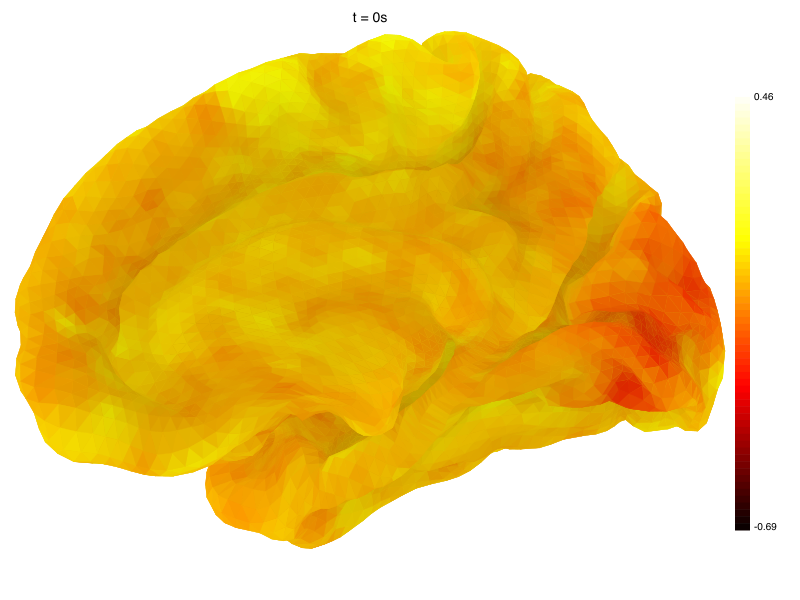 | 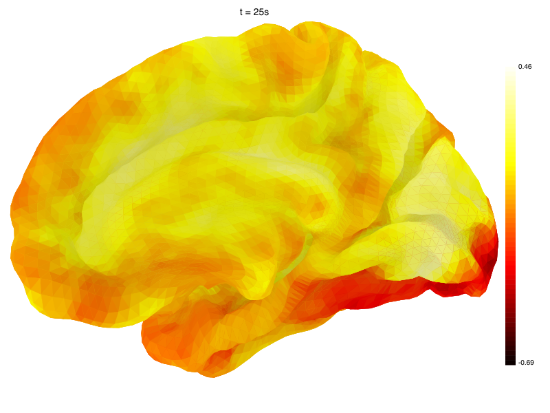 | 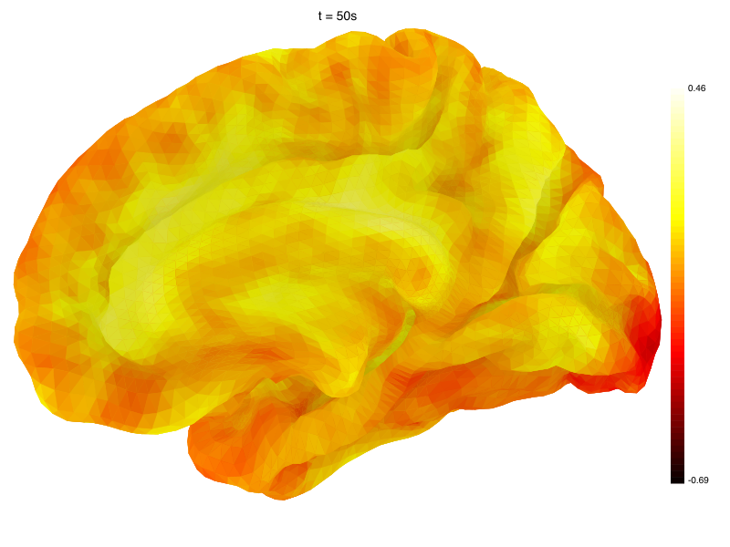 | 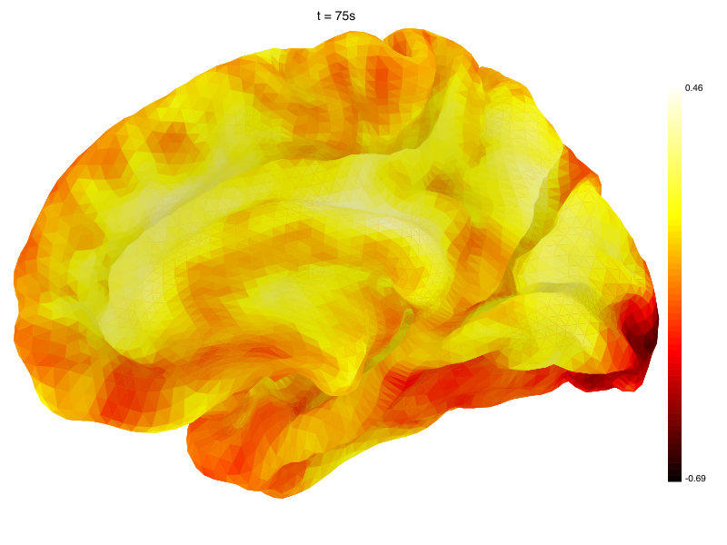 | 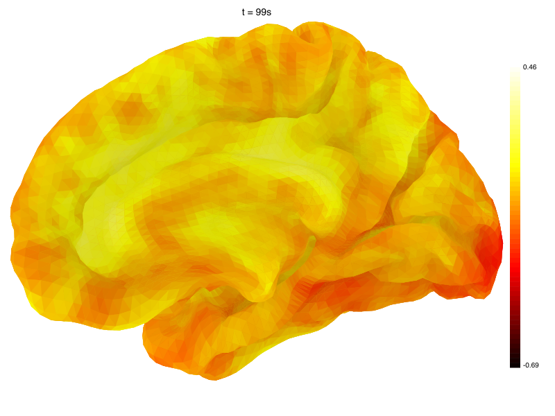 |

**Multi-view overview** (timestep 0):

| Left | Right | Dorsal |
|------|-------|--------|
| 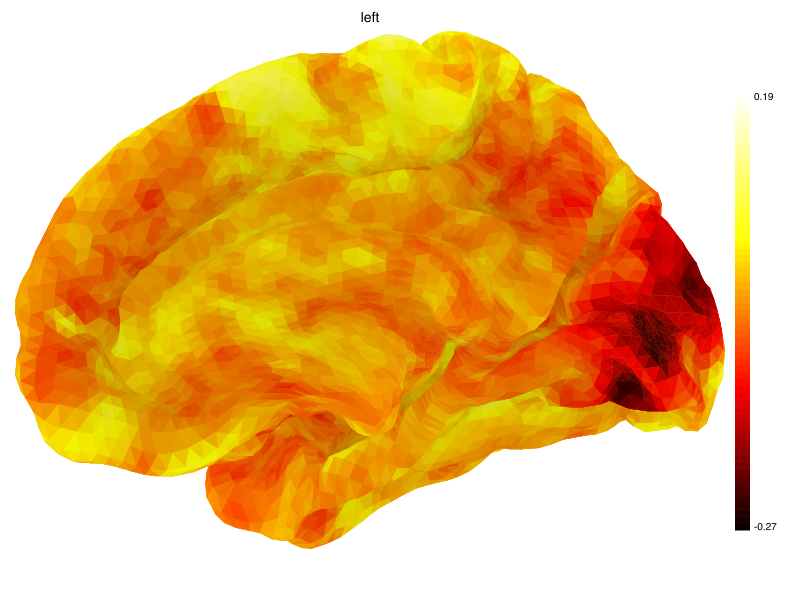 | 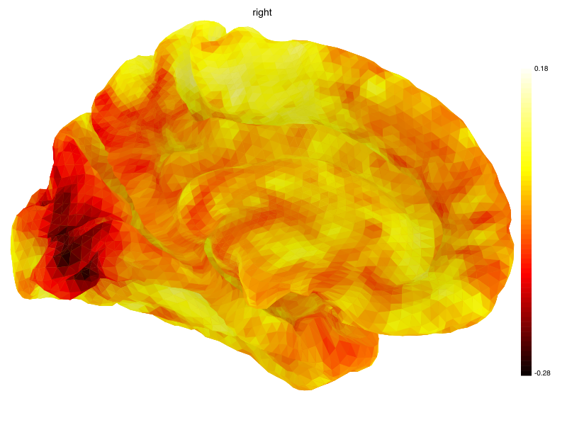 | 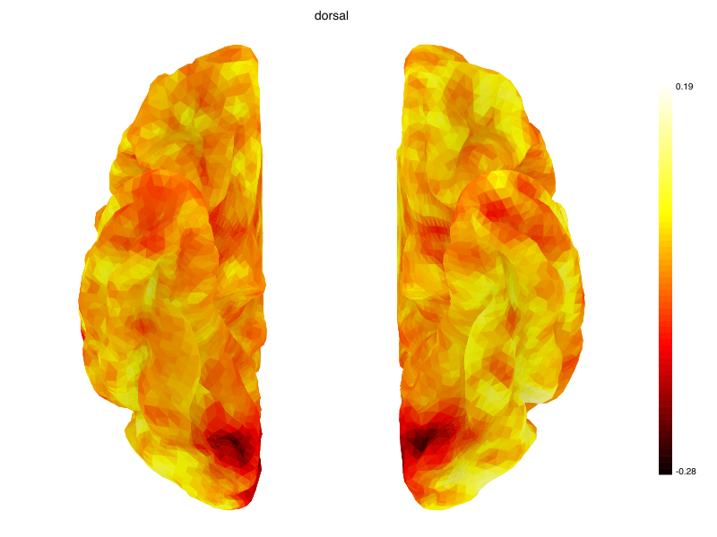 |

### Per-Modality Contribution Maps

Ablation-based contribution: for each modality, the difference in prediction when that modality is zeroed out.

| Text | Audio | Video |
|------|-------|-------|
| 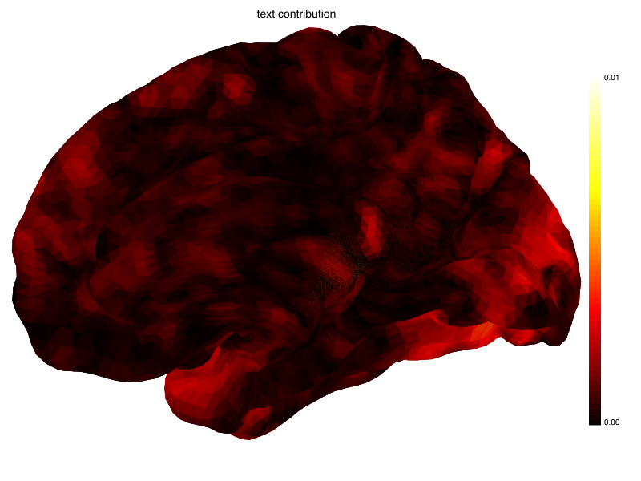 | 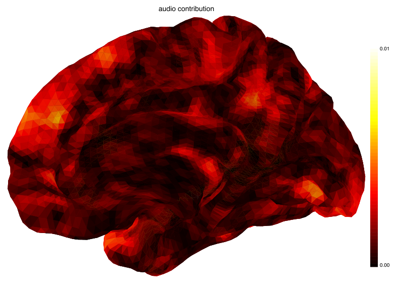 | 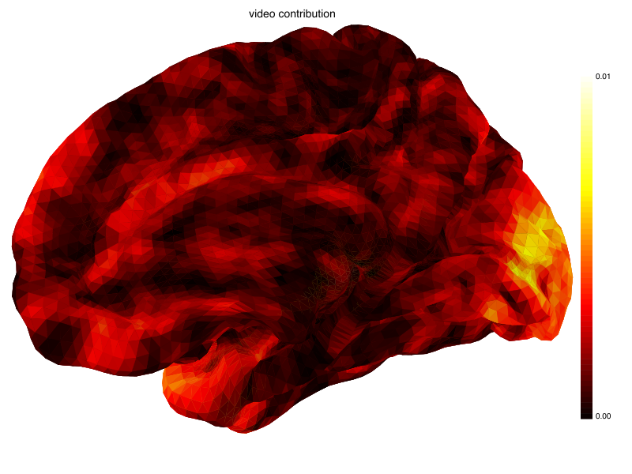 |

Video contributes most strongly to occipital (visual) cortex, text to temporal/frontal language areas.

### NIfTI Volume Output

Surface predictions projected into MNI152 volumetric space (96×96×96 voxels, 2mm isotropic):

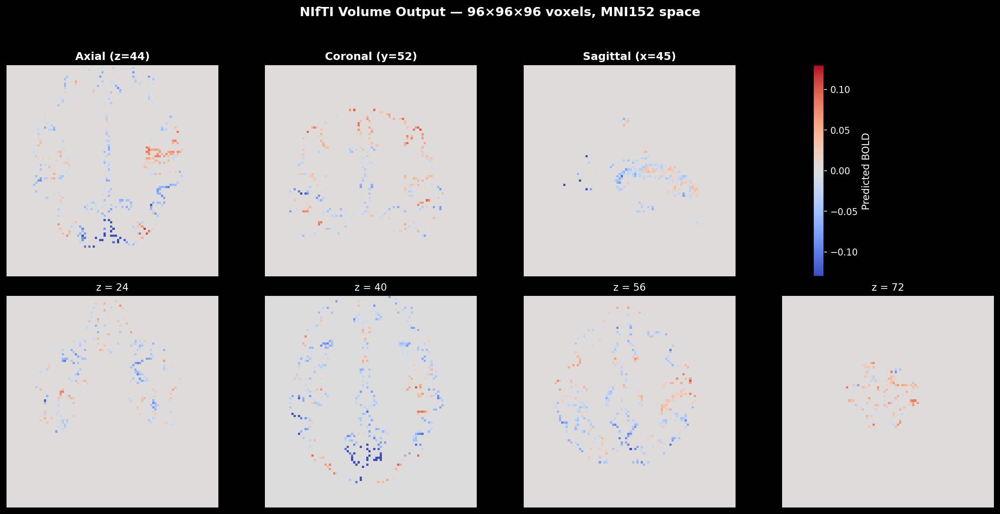

*Top row: axial, coronal, sagittal slices through the center of activity. Bottom row: axial slices at different z-levels. Coolwarm colormap shows predicted BOLD response (red = positive, blue = negative). The sparse pattern reflects the cortical surface vertices projected into volume space.*

```bash
# Generate NIfTI output
cargo run --release --bin tribev2-infer -- \
  --config data/config.yaml --weights data/model.safetensors \
  --text-features text.bin --nifti predictions.nii.gz --nifti-dim 96

# View with any NIfTI viewer (FSLeyes, freeview, nibabel, etc.)
fsleyes predictions.nii.gz
```

### Top-20 Activated Brain Regions (HCP-MMP1)

```
Rank   Region                      Activation
---------------------------------------------
1      a24                           0.075338
2      43                            0.071237
3      Pol1                          0.059974
4      LO2                           0.059593
5      FOP5                          0.057156
6      VIP                           0.056432
7      d32                           0.055918
8      IFSa                          0.053896
9      Ig                            0.051375
10     MIP                           0.051369
11     FOP4                          0.050351
12     IP2                           0.048767
13     9p                            0.048548
14     TE2a                          0.047815
15     PFm                           0.047319
16     23c                           0.045220
17     STSdp                         0.041179
18     IPS1                          0.041100
19     IFJa                          0.040690
20     2                             0.040539
```

### Evaluation Metrics (vs synthetic ground truth)

```
Evaluation Metrics
=============================================
  Timesteps:          100
  Vertices:           20484
  Mean Pearson r:     0.926735
  Median Pearson r:   0.950039
  MSE:                0.000548
  Top-1 accuracy:    0.2000 (20.0%)
```

### Output File Listing

```
examples/outputs/
├── roi_summary.json                  Per-ROI average activation (173 regions)
├── segments.json                     Segment metadata (100 timesteps)
├── nifti_slices.png                  NIfTI volume slice visualization
├── plots_selected/
│   ├── frame_0000.png – frame_0099.png  Per-timestep brain plots
│   └── overview_t0_{left,right,dorsal}.png  Multi-view overview
└── modality_maps/
    ├── text_contribution.png           Text modality contribution
    ├── audio_contribution.png          Audio modality contribution
    └── video_contribution.png          Video modality contribution
```

## Citation

```bibtex
@article{dAscoli2026TribeV2,
  title={A foundation model of vision, audition, and language for in-silico neuroscience},
  author={d'Ascoli, St{\'e}phane and Rapin, J{\'e}r{\'e}my and Benchetrit, Yohann and
          Brookes, Teon and Begany, Katelyn and Raugel, Jos{\'e}phine and
          Banville, Hubert and King, Jean-R{\'e}mi},
  year={2026}
}
```

## License

| Component | License |
|-----------|---------|
| Rust source code | [Apache-2.0](LICENSE) |
| Pretrained model weights | [CC BY-NC 4.0](https://creativecommons.org/licenses/by-nc/4.0/) |
